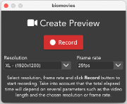
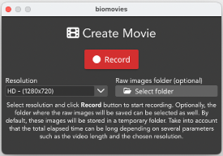
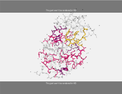

# Create Videos

The process of **creating a video** with **Biomovies** is really **straightforward**. Once the edition of the movie is finished, just click one of the **three options** available to start recording.

## Create New Preview 

A preview is, in fact, a **screen record**. **Biomovies** plays the **Timeline** in real time and records it. Thus, the resolution is not standard, but **depends on your screen**. 

For recording a **New Preview**, go to menu _Create Video > New Preview_ or use the shortcut ⌘/Ctrl + P. This action will put **Biomovies** in full screen and will open a **new window** as well.

In this new window, users can choose the **resolution** and the **frame rate** for the new video. 

* As explained before, the resolution **depends on the screen** on which **Biomovies** is being executed. Therefore, if you have a Full HD monitor, the movie can have this resolution. All the available resolutions have the **aspect ratio** of the screen. There are **four** available **resolutions**:
    
    * **XL:** **screen size width** (_1920x1200_ in the figure above)
    * **L:** width **1280**, height according to screen aspect ratio (_1280x800_ in the figure above)
    * **M:** width **1024**, height according to screen aspect ratio (_1024x640_ in the figure above)
    * **S:** width **800**, height according to screen aspect ratio (_800x500_ in the figure above)

* As for the frame rate, users can choose between **25, 20 or 10 frames per second**.

Once the _Record_ button is pressed, the **render** process starts. This **render** process consists of recording the movie in **real time**, so it will take the same length of the **Timeline**. 

After the **render** process is finished, it starts the **video generation**. This part can take more or less time depending on the **resolution** chosen and the **resources** of the computer where **Biomovies** is being executed. Once the **video generation** is finished, a system dialog is shown to ask the user **where to save** the video.

**Tip:** in **macOS**, the process of recording the screen captures the **mouse** as well, so though this is a **preview video**, if you don't want to see the mouse in the **video**, it's recommended to have it **inside the Create Preview window**.

All the **Preview Videos** generated by **Biomovies** are in **MP4** format and **H.264** compression. Take into account that, as the **movie size** depends on the **screen size**, not always the outcome will be a **standard resolution**, for doing that, please [**use the Create New Movie**](#create-new-movie) option.

<iframe width="560" height="315" src="https://www.youtube.com/embed/_6d5OFaaOv8?si=ig2-jPuR87YzcPD1" title="YouTube video player" frameborder="0" allow="accelerometer; autoplay; clipboard-write; encrypted-media; gyroscope; picture-in-picture; web-share" allowfullscreen></iframe>

## Create New Movie 

The process of the creation of a **New Movie** differs from the **Preview** and the **GIF** in one main feature: in this case, the render process consists of **capturing and saving as images** all the **frames** composing the movie. After saving all this images, the Movie is generated. Thus, the rendering time is **not in real time**, but it depends on the **duration** of the **Timeline**, the chosen **resolution** and the **hardware specificacions** of the computer where **Biomovies** is being executed.

For recording a **New Movie**, go to menu _Create Video > New Movie_ or use the shortcut ⌘/Ctrl + M. This action will put **Biomovies** in full screen and will open a **new window** as well.

In this new window, users can choose the **resolution** of the new video and, optionally, the **raw images folder** where the rendering images will be saved. 

* In this case, the resolution **doesn't depends on the screen** on which **Biomovies** is being executed. Therefore, there are **three** available **standard resolutions**, all of them with a **16:9** aspect ratio:
    
    * **HD:** or HD 720p, **1280x720**
    * **FULLHD:** or Full HD 1080p, **1920x1080**
    * **QHD:** or 1440p, WQHD, 2K, **2560x1440**

* Clicking in the **raw images folder** button will allow to save the **render images** in the selected place. Otherwise they will be stored in a **temporary** folder.

Once the _Record_ button is pressed, the **render** process starts. This **render** process consists of saving **one image for each frame** of the **Timeline**, so the time it will take depends on **multiple factors**, such as the total **video length**, the chosen **resolution** or the **hardware specifications** of the computer in which **Biomovies** is being executed. 

After the **render** process is finished, it starts the **video generation**. This part can take more or less time depending on the **resolution** chosen and the **resources** of the computer where **Biomovies** is being executed. Once the **video generation** is finished, a system dialog is shown to ask the user **where to save** the video.

**Tip:** it is **highly recommended** to have the [**Letterboxing tool enabled**](interface.html#enable-disable-letterboxing) during the process of generating a movie. After enabling it, two **stripes** will appear showing to the user which parts of the stage will be **rendered** and which not. In some cases (when the screen **aspect ratio** is **16:9**) these stripes won’t appear.

The render process will only take into account the part of the stage between the stripes

All the **Movie Videos** generated by **Biomovies** are in **MP4** format and **H.264** compression.

<iframe width="560" height="315" src="https://www.youtube.com/embed/91y7YUyBE8I?si=wAd23bPMxMAyfRw3" title="YouTube video player" frameborder="0" allow="accelerometer; autoplay; clipboard-write; encrypted-media; gyroscope; picture-in-picture; web-share" allowfullscreen></iframe>

## Create New GIF  

The process of creating a new animated GIF is very similar to the one seen above for creating a [**New Preview**](#create-new-preview). That means, a **screen record**. **Biomovies** plays the **Timeline** in real time and records it. Thus, the resolution is not standard, but **depends on your screen**. 

For recording a **New GIF**, go to menu _Create Video > New GIF_ or use the shortcut ⌘/Ctrl + G. This action will put **Biomovies** in full screen and will open a **new window** as well.

In this new window, users can choose the **resolution** and the **frame rate** for the new animated GIF. 

* As explained before, the resolution **depends on the screen** on which **Biomovies** is being executed. In this case, and for the sake of the **efficiency**, it is not allowed to generate an animated GIF with the size of the **whole screen**. Take into account that animated GIFs have not the same **compression** and **quality** of a **MP4 video**. A GIF can be useful for putting a **small video** inside a markdown file, but for showing a long video in **full screen**, use always a video. All the available resolutions have the **aspect ratio** of the screen. There are **four** available **resolutions**:
    
    * **L:** width **1024**, height according to screen aspect ratio (_1024x640_ in the figure above)
    * **M:** width **800**, height according to screen aspect ratio (_800x500_ in the figure above)
    * **S:** width **640**, height according to screen aspect ratio (_640x400_ in the figure above)
    * **XS:** width **480**, height according to screen aspect ratio (_480x300_ in the figure above)

* As for the frame rate, users can choose between **2, 5 or 10 frames per second**.

Once the _Record_ button is pressed, the **render** process starts. This **render** process consists of recording the movie in **real time**, so it will take the same length of the **Timeline**. 

After the **render** process is finished, it starts the **video generation**. This part can take more or less time depending on the **resolution** chosen and the **resources** of the computer where **Biomovies** is being executed. Once the **video generation** is finished, a system dialog is shown to ask the user **where to save** the GIF file.

**Tip:** in **macOS**, the process of recording the screen captures the **mouse** as well, so though this is a **preview video**, if you don't want to see the mouse in the **video**, it's recommended to have it **inside the Create GIF window**.

All the **animated GIFs** generated by **Biomovies** are, obviously, in **GIF** format.

