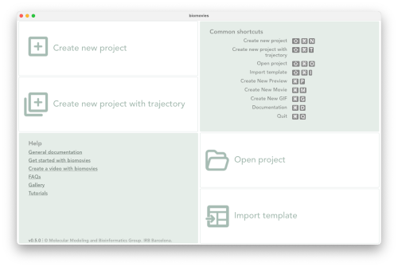
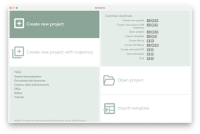
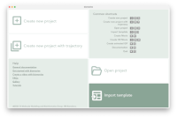

# Getting started

Application home screen

## New Project 

Creating a new project with **Biomovies** is as easy as clicking the _Create new project_ button (or via menu: _Project > New Project_) and selecting a 3D biological structure file (in **PDB** or **MMCIF** format) from the user’s computer.

Shortcut: &#8984;/Ctrl + &#x21E7; + N

## New Project with Trajectory

The process of creating a new project with a **trajectory** starts by clicking the _Create new project with trajectory_ button (or via menu: _Project > New Project with Trajectory_) and selecting a 3D biological structure file (in **PDB** or **MMCIF** format) as a topology and its corresponding trajectory (in **NETCDF**, **XTC** or **DCD** format) from the user’s computer. Note that both files must be selected at the **same time**, so it's recommended to have them in the **same folder** at the time of creating the new project.

Be aware that, if the **trajectory** doesn’t fit the **topology**, **errors** will happen in the representation of the structure. It is very important too that the trajectory is **well created** and **tested** with its corresponding topology in a visualization program such as [**VMD** <i class="fa-solid fa-up-right-from-square" style="font-size: 12px;"></i>](https://www.ks.uiuc.edu/Research/vmd/).

Take into account that, depending on the **trajectory size** and the **memory** of the computer, the loading process can take a while. Consider as well that, if the trajectory is big and the project is saved in a **.biomovies** file, this file will contain the trajectory along with the topology. So, consequently, the **final size** of the project file will be **big** as well.

In those cases it can be worth considering exporting the project **as a template** instead of saving it as a project. A **template** only saves the project information (but not the structure and the trajectory) and, therefore, the **file size** is really **small**. 

Shortcut: &#8984;/Ctrl + &#x21E7; + T

## Open Project 

Just click the _Open project_ button (or via menu: _Project > Open Project_ or _Project > Open Recent_) and select a **.biomovies** file from the user’s computer. A **.biomovies** file contains all the necessary information of the project, including the **3D structure** file and the **trajectory** file (if necessary). 

Recent projects can be opened as well from the **JumpList** in **Windows** and from the **Application dock menu** in **macOS**.

Shortcut: &#8984;/Ctrl + &#x21E7; + O

## Import Template

Templates are a very interesting option for applying the **same video edition** to **different structures**. They are worth considering too for sharing a project, since a **template** only saves the project information (but not the structure and the trajectory) and, therefore, the **file size** is really **small**. 

Clicking the _Import template_ button (or via menu: _Project > Import Template_) will ask to select a **.tbiomovies** file from the user’s computer. As the **.tbiomovies** file only contains the necessary information to create a new project but **not** the **3D structure** file and the **trajectory** file (if necessary), after loading it, a new dialog window will ask for this **3D structure** file and the **trajectory** file (if it is a trajectory template). After these two steps, a **new project** is created applying the **actions** of the template on the new **3D structure** (and the **trajectory** if provided).

Shortcut: &#8984; + &#x21E7; + I for **macOS**, Ctrl + Alt + I for **Windows** / **Ubuntu**

## Help

A broad documentation has been written and is available in this same [**Read the Docs**](introduction.html). Besides, there are several video examples available in the [**Gallery** <i class="fa-solid fa-up-right-from-square" style="font-size: 12px;"></i>](https://gbayarri.github.io/biomovies/#gallery) as well as some [**Tutorials** <i class="fa-solid fa-up-right-from-square" style="font-size: 12px;"></i>](https://gbayarri.github.io/biomovies/#tutorials) in the [**official website** <i class="fa-solid fa-up-right-from-square" style="font-size: 12px;"></i>](https://gbayarri.github.io/biomovies).

## Common shortcuts

When launching the application, a list of **common shortcuts** is shown (see figure _Application home screen_ in this same section). However, a list with all the shortcuts available can be found in the [**Utilities**](utilities.html#shortcuts) section.
