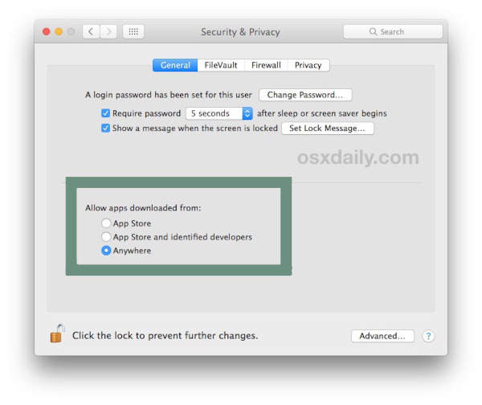

# Installation

## macOS

At the moment of launching the current release, the **Biomovies** macOS binaries are **unsigned**. That means that macOS treats them as untrusted software. So, for executing it, please follow the next steps: 

* Open the **Finder**.
* Locate the **app** (it might be in the **Applications** folder, or it might still be in your **Downloads** folder).
* **Ctrl-Click** or **right-click** on the app. 
* Select **Open** from the resultant menu and the app will be opened anyway, and an **exception** will be created for opening it normally (i.e. by double-clicking) in future.

If the above steps don't work, here they are the workarounds for make working both the **universal (Intel)** and **Apple silicon (arm64)** version of **Biomovies**: 

### Universal / Intel 

A universal binary runs natively on **both Apple silicon and Intel-based Mac** computers, because it contains executable code for both architectures. For downloading the **Universal** version of **Biomovies**, go to the [**website download** <i class="fa-solid fa-up-right-from-square" style="font-size: 12px;"></i>](https://gbayarri.github.io/biomovies/#download) section and click the _macOS Universal_ button. Note that, though this version works as well with an Apple silicon computer, the [**ARM64**](#apple-silicon-arm64) version is recommended for being more **optimized** for this kind of **architecture**.

Download the dmg file, install the application dragging the icon to the Applications folder, and, before opening the application, open **Settings > Security and Privacy** and click **Anywhere** under the _Allow apps downloaded from_ section:



Note that this option has disappeared from **Mac OS High Sierra** onwards, so in this case, select _App Store and identified developers_. After that, try to open the application and this message will be shown:


Go back to **Settings > Security and Privacy** and, below _App Store and identified developers_ a new message will be shown:

**“Biomovies” was blocked from opening because it is not from an identified developer**

**Click** the _Open Anyway_ button at right and now the application should work.

### Apple silicon / ARM64

An **Apple silicon** binary runs only in Apple silicon computers. For downloading the **Apple silicon** version of **Biomovies**, go to the [**website download** <i class="fa-solid fa-up-right-from-square" style="font-size: 12px;"></i>](https://gbayarri.github.io/biomovies/#download) section and click the _macOS Apple Silicon_ button.

Download the dmg file, install the application dragging the icon to the Applications folder, and, before opening the application, open the Terminal, **type the following code** and press Enter:

```bash
xattr -r -d com.apple.quarantine /Applications/biomovies.app
```

Now the application should work properly.

## Ubuntu

For downloading the **Ubuntu** version of **Biomovies**, go to the [**website download** <i class="fa-solid fa-up-right-from-square" style="font-size: 12px;"></i>](https://gbayarri.github.io/biomovies/#download) section and click the _Ubuntu_ button (**.deb** and **.AppImage** binaries available). At the moment of launching the current release, there is only a **x64 architecture** binary for **Ubuntu**.

### deb

#### Command line

Open the Terminal and **type the following code**:

```bash
sudo apt install path_to_deb_file
```

Be sure to put the absolute / relative path, not just the file name.

#### Graphical User Interface

Right click on **.deb** file, select **Open With Other Application** and select **Software Install**. This opens **Ubuntu Software**. Click Install button:


Now the application is installed in your computer.

### AppImage

First off, be sure to have **FUSE** installed in your coumputer. If not, please, type on terminal:

```bash
sudo apt-get install fuse libfuse2  # Ubuntu < 22.04
sudo apt install libfuse2 # Ubuntu >= 22.04
```

#### Command line

Open the Terminal and **type the following code**:

```bash
chmod +x path_to_AppImage_file
./path_to_AppImage_file
```

Be sure to put the absolute / relative path, not just the file name.

#### Graphical User Interface

Double click **.AppImage** file.

## Windows

For downloading the **Windows** version of **Biomovies**, go to the [**website download** <i class="fa-solid fa-up-right-from-square" style="font-size: 12px;"></i>](https://gbayarri.github.io/biomovies/#download) section and click the _Windows_ button. At the moment of launching the current release, there is only a **x64 architecture** binary for **Windows**.

Windows treats the **Biomovies** executable file as an unrecognized app. So, after double clicking the **.exe** file, Windows will open the following window:


Click on _More info_ and then, on _Run anyway_ button for starting the installation.


