# Video Editor

Video Editor

## Representation

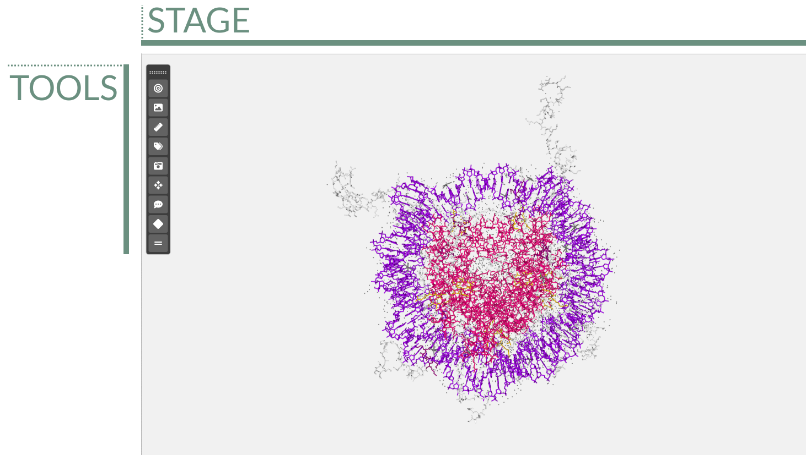

The **stage** is the area where the 3D biological structure is represented, the **tools bar** allows to apply actions to the stage.

### Tools

The tools menu is at the top left of the **stage** and allows users to make some actions over it.

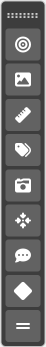

This menu is **draggable** around all the stage and can be **collapsed / expanded** by clicking twice on the handler. For **hiding** it completely, go to _View > Tools_ in the menu. Click in the same menu for **showing** it again.

#### Center

Clicking this button **centers** the structure(s) position on the **stage**. This button is active only if **one single keyframe** of the timeline has been selected.

#### Background

Clicking this button opens a **color picker** that allows users to change the **background color** of the **stage**.

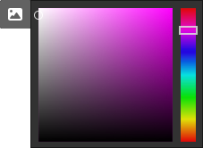

Click **again** on the button for **hiding** the color picker.

#### Measurements

Clicking this button **opens a modal dialog** to edit the **distances and angles** created by users in the stage. For remembering how to draw them, please go to the [**Mouse click actions section**](#mouse-click-actions).

**Measurements** with size and color **by default**:

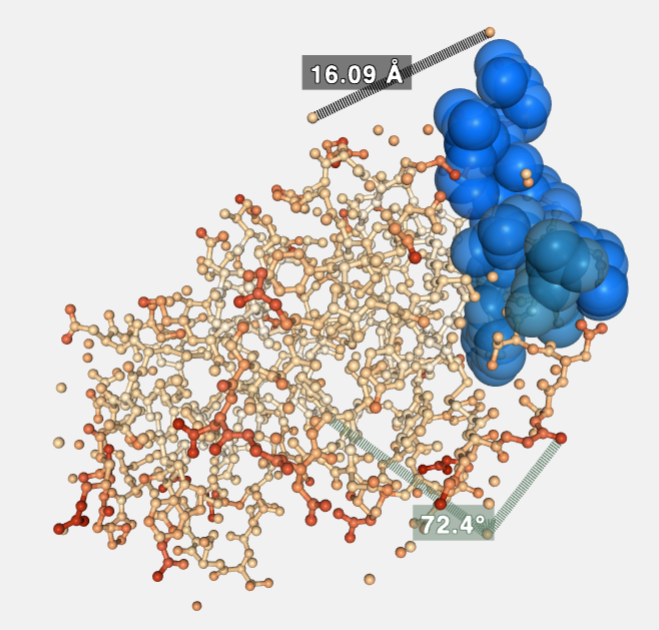

##### Distances

**Distances** editor before editing size and color:

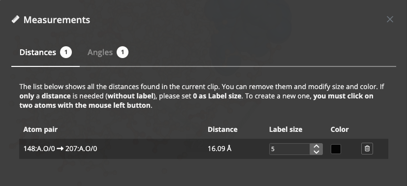

**Distances** editor after editing size and color:

If **only a distance** is needed (**without label**), please set **0 as Label siz**e.

##### Angles

**Angles** editor before editing size and color:

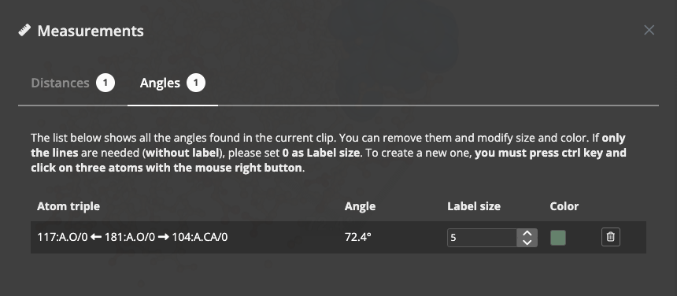

**Angles** editor after editing size and color:

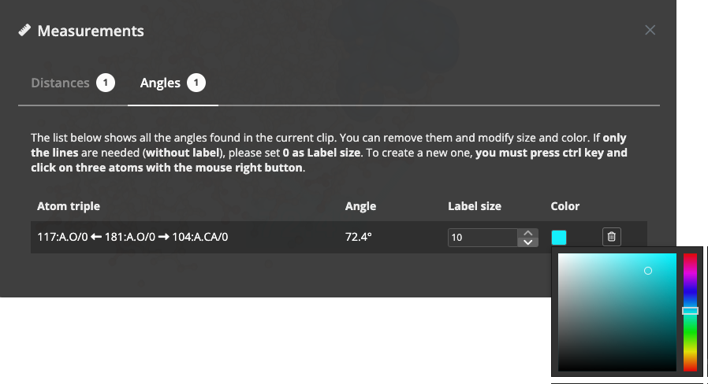

If **only the lines** are needed (**without label**), please set **0 as Label size**.

**Measurements** after **size and color edition**:

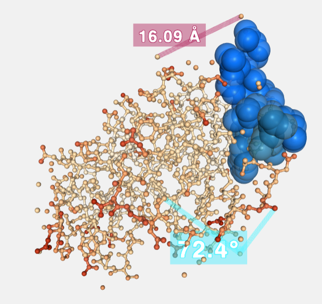

#### Labels

Clicking this button **opens a modal dialog** to edit the **labels** created by users in the stage. For remembering how to draw them, please go to the [**Mouse click actions section**](#mouse-click-actions).

**Labels** with size, text and color **by default**:

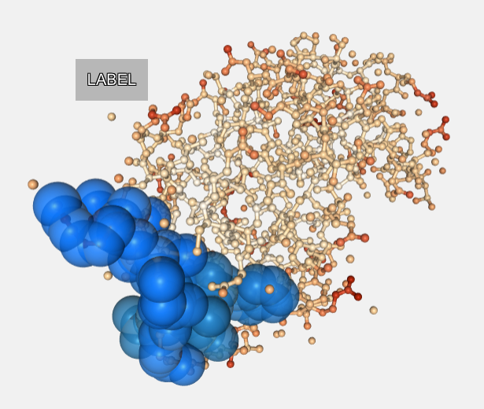

**Labels** editor before editing text, size color and background:

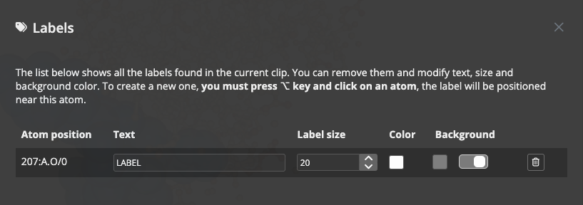

**Labels** editor after editing text, size color and background:

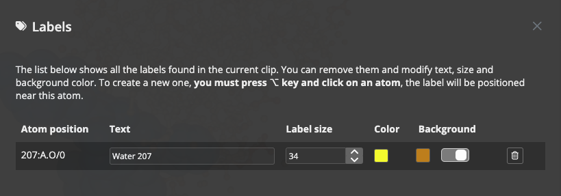

Label **background** can be modified. Moreover, it can be **disabled** as well with the switch beside the background color **selector**.

**Labels** after **size, text and color edition**:

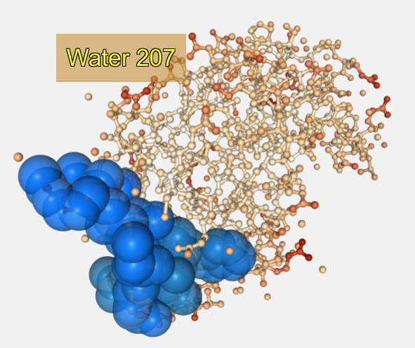

#### Camera type

Switches camera type between **orthographic** and **perspective**.

#### Center view in atom

Click this button and then, **select an atom** of the structure, the view will be **focused** into this atom position. This button is active only if **one single keyframe** of the timeline has been selected.

#### Enable / Disable legend

Enables / disables a **legend** on the bottom right of the **stage**. This **legend** shows information for the molecule the mouse has hovered over in the next format:

> Model **number** | Chain **ID** | **Residue name (Residue long name) Residue number** Atom name (or Bond)

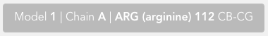

#### Open keyframe editor

Clicking this button **opens a keyframe editor**. 

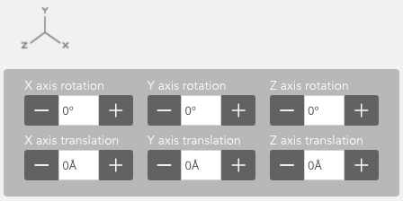

In this editor, users can change the **rotation** and **translation** of the biological structure.

This button is active only if **one single keyframe** of the timeline has been selected.

#### Enable / Disable letterboxing

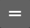

Enables / disables letterboxing on the **stage**. Two **stripes** will appear showing to the user which parts of the stage will be **rendered** and which not in case of **HD rendering**. In some cases (depending on the screen **aspect ratio**) these stripes won’t appear.

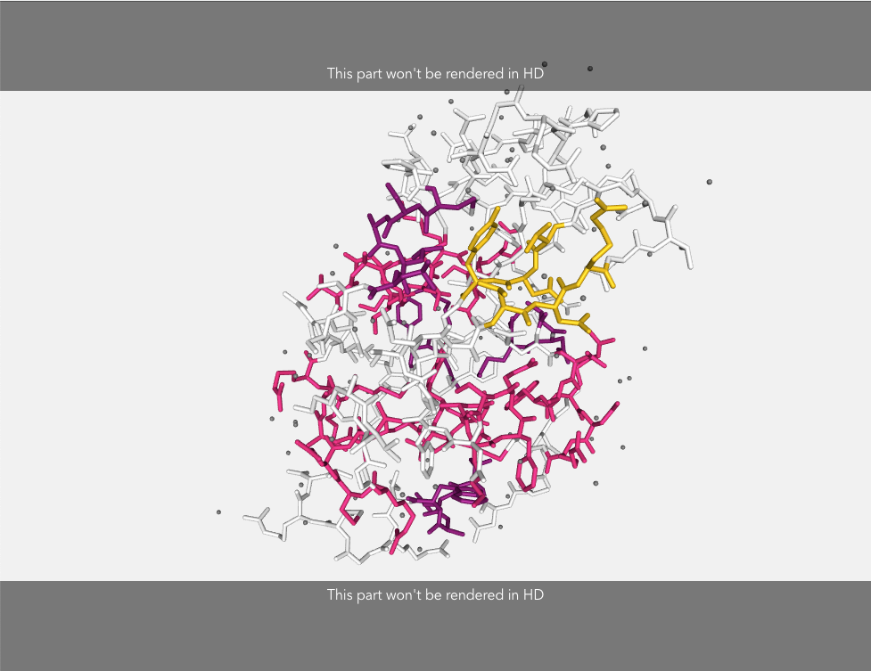

Click **again** on the button for **removing** the stripes from the stage.

### Stage

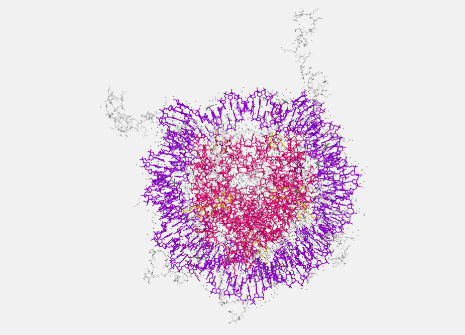

The **stage** covers the main part of the screen. In the stage the **structure is loaded** and **represented**, and users can interact with it in several ways.

#### Zoom / Drag

Before applying **rotation**, **translation** or **zoom** to the stage, a [**keyframe must be selected in the timeline**](#timeline-editor).

Actions of **zoom in** and **zoom out** can be done with the **scroll mouse or the trackpad** of a laptop:

* Clicking on the stage with the **left button** and **dragging will rotate the view**.

* Clicking on the stage with the **right button** and **dragging will translate the view**.

* Mouse wheel (or using the trackpad with two fingers) on the stage will **zoom in** or **zoom out**.

All these modifications in the **general orientation** of the structure will be applied to the **selected keyframe**. That means that, in a **clip**, the **first** and the **last frame** can have different **rotation**, **translation** or **zoom**. **Biomovies** will take care of the **interpolation** between frames.

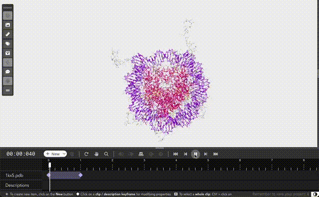

Automatic transition between two frames with different orientations

#### Mouse actions

##### Mouse over actions

Passing the mouse over the molecules of the structure will **highlight** them and show **their information** in the **legend** on the bottom right of the stage. [**Click here**](#enable-disable-legend) to see how to enable the legend.

##### Mouse click actions

* Clicking with the mouse **left button** on an atom while pressing the **Alt or ⌥ key** will **place a Label** close to this atom. [**Click here**](#labels) to see how to edit labels.

* Clicking **consecutively on two atoms** with the mouse **left button** will draw and calculate the **distance** in **ångströms** between these two atoms. [**Click here**](#distances) to see how to edit distances.

* Clicking **consecutively on three atoms** with the mouse **right button** while pressing the **Ctrl key** will draw and calculate the **angle** in **degrees** between these three atoms. [**Click here**](#angles) to see how to edit angles.

## Timeline

### Timer

### Create new timeline item

#### Clip

#### Cloned Clip

#### Transition

#### Fade In

#### Fade Out

#### Description

### Timeline menu

#### Remove

#### Timeline controls

##### Reset timeline

##### Pan mode

##### Zoom

#### Keyframes actions

##### Align last keyframe

##### Align first keyframe

##### Select all keyframes

##### Move keyframes left

##### Move keyframes right

#### Player

##### Go to first frame

##### Go to previous frame

##### Play / Pause

##### Go to next frame

##### Go to last frame

### Main structure

### Descriptions

### Timeline editor

### Tips

## Controls

### Keyframes / Clips

#### Menu

##### Create new representation

##### Hide all

##### Collapse all

#### Edit representation

##### Representation menu

###### Representation name

###### Hide representation

###### Clone representation

###### Center in this representation

###### Remove representation

###### Collapse representation editor

##### Selection

###### Standard selection

###### Custom selection

##### Opacity

##### Molecular representation

##### Color

##### Radius

### Trajectories

#### Enable / Disable trajectory

#### Range

#### Step

#### Timeout

#### Play in reverse

#### Fit clip in timeline

### Descriptions

#### Description text

#### Font size

#### Font family

#### Font Color

#### Background Color

#### Background Visibility

#### Description position

## Status Bar

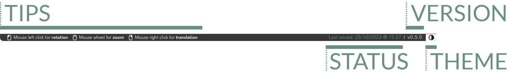

Status bar

The **status bar** is at the **bottom** of the application. It can be **enabled** / **disabled** via menu (_View > Status Bar_)

### Tips

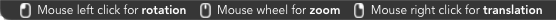

This section of the **status bar** shows **tips** depending on the area of the application where the mouse is located. There are tips for:

* Stage
* Tools
* Controls
* Timeline
* Splitter

### Project status

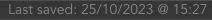

This section of the **status bar** shows the current **status** of the project: either the last time it was saved or a prompt warning that the project hasn't been saved yet.

### Version

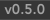

This section of the **status bar** shows the current **version** of the application.

### Theme

Clicking on this section of the **status bar** the application theme will toggle between **dark** and **light**. This option can be toggled as well via menu (_View > Light Theme_ or _View > Dark Theme_)

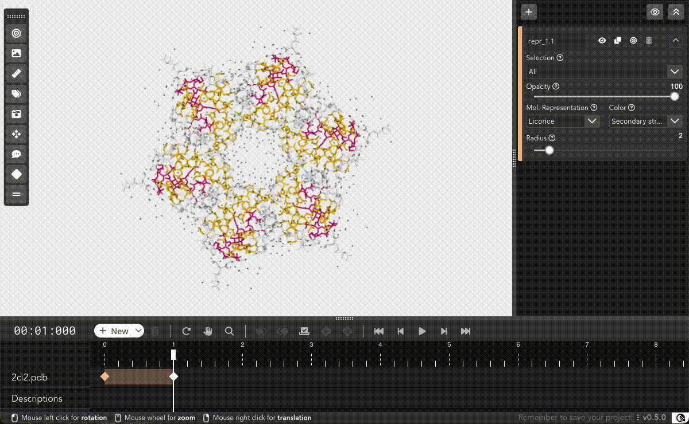

Toggling between themes