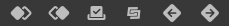
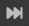
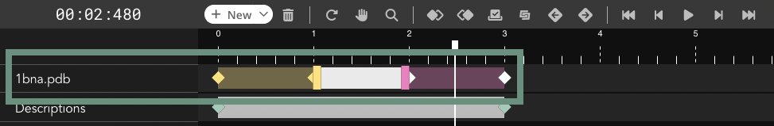
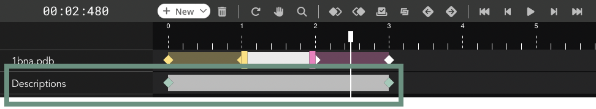
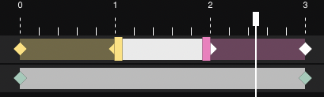
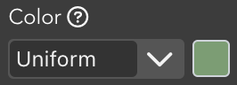
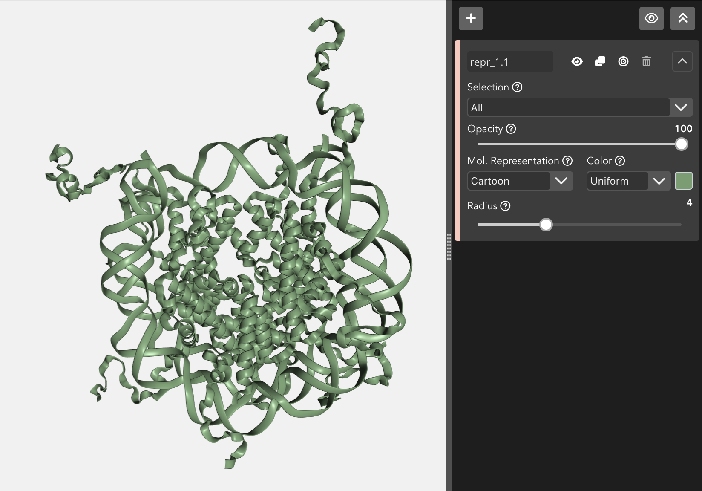
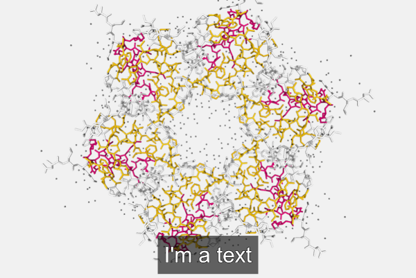
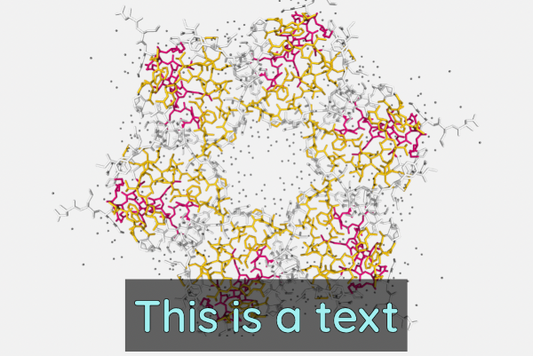

(video_editor_target)=
# Video Editor

Video Editor

(video_editor_stage_target)=
## Stage

The **stage** is the area where the 3D biological structure is represented, the **tools bar** allows to apply actions to the stage.

### Tools

The tools menu is at the top left of the **stage** and allows users to make some actions over it.

This menu is **draggable** around all the stage and can be **collapsed / expanded** by clicking twice on the handler. For **hiding** it completely, go to _View > Tools_ in the menu. Click in the same menu for **showing** it again.

#### Center

Clicking this button **centers** the structure(s) position on the **stage**. This button is active only if **one single keyframe** of the timeline has been selected.

#### Background

Clicking this button opens a **color picker** that allows users to change the **background color** of the **stage**.

Click **again** on the button for **hiding** the color picker.

#### Measurements

Clicking this button **opens a modal dialog** to edit the **distances and angles** created by users in the stage. For remembering how to draw them, please go to the [**Mouse click actions section**](#mouse-click-actions).

**Measurements** with size and color **by default**:

(video_editor_distances_target)=
##### Distances

**Distances** editor before editing size and color:

**Distances** editor after editing size and color:

If **only a distance** is needed (**without label**), please set **0 as Label siz**e.

(video_editor_angles_target)=
##### Angles

**Angles** editor before editing size and color:

**Angles** editor after editing size and color:

If **only the lines** are needed (**without label**), please set **0 as Label size**.

**Measurements** after **size and color edition**:

(video_editor_labels_target)=
#### Labels

Clicking this button **opens a modal dialog** to edit the **labels** created by users in the stage. For remembering how to draw them, please go to the [**Mouse click actions section**](#mouse-click-actions).

**Labels** with size, text and color **by default**:

**Labels** editor before editing text, size color and background:

**Labels** editor after editing text, size color and background:

Label **background** can be modified. Moreover, it can be **disabled** as well with the switch beside the background color **selector**.

**Labels** after **size, text and color edition**:

#### Camera type

Switches camera type between **orthographic** and **perspective**.

#### Center view in atom

Click this button and then, **select an atom** of the structure, the view will be **focused** into this atom position. This button is active only if **one single keyframe** of the timeline has been selected.

(video_editor_legend_target)=
#### Enable / Disable legend

Enables / disables a **legend** on the bottom right of the **stage**. This **legend** shows information for the molecule the mouse has hovered over in the next format:

> Model **number** | Chain **ID** | **Residue name (Residue long name) Residue number** Atom name (or Bond)

#### Open keyframe editor

Clicking this button **opens a keyframe editor**. 

In this editor, users can change the **rotation** and **translation** of the biological structure.

This button is active only if **one single keyframe** of the timeline has been selected.

(video_editor_letterboxing_target)=
#### Enable / Disable letterboxing

Enables / disables letterboxing on the **stage**. Two **stripes** will appear showing to the user which parts of the stage will be **rendered** and which not in case of [**Creating a New Movie**](create_videos_movie_target). In some cases (when the screen **aspect ratio** is **16:9**) these stripes won’t appear.

Click **again** on the button for **removing** the stripes from the stage.

### Structure Stage

The **stage** covers the main part of the screen. In the stage the **structure is loaded** and **represented**, and users can interact with it in several ways.

#### Zoom / Drag

Before applying **rotation**, **translation** or **zoom** to the stage, a [**keyframe must be selected in the timeline**](#timeline-editor).

Actions of **zoom in** and **zoom out** can be done with the **scroll mouse or the trackpad** of a laptop, besides, **rotation** and **translation** can be applied as well:

* Clicking on the stage with the **left button** and **dragging will rotate the view**.

* Clicking on the stage with the **right button** and **dragging will translate the view**.

* Mouse wheel (or using the trackpad with two fingers) on the stage will **zoom in** or **zoom out**.

All these modifications in the **general orientation** of the structure will be applied to the **selected keyframe**. That means that, in a **clip**, the **first** and the **last frame** can have different **rotation**, **translation** or **zoom**. **Biomovies** will take care of the **interpolation** between frames.

Automatic transition between two frames with different orientations

#### Mouse actions

##### Mouse over actions

Passing the mouse over the molecules of the structure will **highlight** them and show **their information** in the **legend** on the bottom right of the stage. [**Click here**](#enable-disable-legend) to see how to enable the legend.

##### Mouse click actions

* Clicking with the mouse **left button** on an atom while pressing the **Alt or &#x2325; key** will **place a Label** close to this atom. [**Click here**](#labels) to see how to edit labels.

* Clicking **consecutively on two atoms** with the mouse **left button** will draw and calculate the **distance** in **ångströms** between these two atoms. [**Click here**](#distances) to see how to edit distances.

* Clicking **consecutively on three atoms** with the mouse **right button** while pressing the **Ctrl key** will draw and calculate the **angle** in **degrees** between these three atoms. [**Click here**](#angles) to see how to edit angles.

(video_editor_timeline_target)=
## Timeline

The **Timeline**, placed at the bottom part of the application, allows the users to control and edit the **clips** and the **keyframes** that shape the representation.

### Timer

Placed at the top left corner of the **Timeline**, indicates the **exact time** where the cursor is.

### Create new timeline item

This menu allows to **create new items** in the timeline:

#### Clip

Creates a **new clip** in the timeline. Note that for creating a new clip an existing one must be selected. The new clip will be added **after this selected clip**. If there is not enough space, the new clip will be added at **the end of the timeline**.

Shortcut: &#8984;/Ctrl + &#x21E7; + C

#### Cloned Clip

Clones an **existing clip** from the timeline. Note that for cloning a new clip an existing one must be **already selected** in order to clone it. The new clip will be added **after this selected clip**. If there is not enough space, the new clip will be added at **the end of the timeline**.

Shortcut: &#8984;/Ctrl + &#x2325;/Alt + C

#### Transition

Creates a **transition between two clips**. Two **consecutive keyframes** of **different clips** with a minimum gap of 400ms between them must be selected before performing this action.

Shortcut: &#8984;/Ctrl + &#x21E7; + T

#### Fade In

Creates a **Fade In transition before a clip**. The **initial keyframe** of the clip must be selected before performing this action. There must be a minimum gap of 480ms between the previous keyframe and the one selected. 

Shortcut: &#8984; + &#x21E7; + I for **macOS**, Ctrl + Alt + I for **Windows** / **Ubuntu**

#### Fade Out

Creates a **Fade Out transition after a clip**. The **final keyframe** of the clip must be selected before performing this action. There must be a minimum gap of 480ms between the next keyframe and the one selected.

Shortcut: &#8984;/Ctrl + &#x21E7; + O

#### Description

Creates a new **description** in the timeline.

Shortcut: &#8984;/Ctrl + &#x21E7; + D

### Timeline menu

In this **menu**, divided into **four areas**, there can be found all the possible actions to apply to the **Timeline**.

#### Remove

The remove button allows the user to **remove** the selected **clip** or **transition**. For the sake of security, the button must be **clicked twice**.

(video_editor_tml_ctrls_target)=
#### Timeline controls

This submenu has the actions for controlling the **Timeline** area.

##### Reset timeline

Clicking this button **resets** the **Timeline editor**: disables the **Pan Mode** (if enabled), resets the **Zoom** to the initial value (if changed) and moves the **cursor** to the beginning.

Shortcut: &#8984;/Ctrl + &#x2325;/Alt + R

##### Pan mode

Clicking this button enables / disables the **Pan Mode**, which allows to **drag the whole Timeline editor**.

Shortcut: &#8984;/Ctrl + &#x2325;/Alt + A

##### Zoom

Clicking this button enables / disables the **Zoom Mode**, which allows to **zoom into the Timeline editor**.

Shortcut: &#8984;/Ctrl + &#x2325;/Alt + Z

Tips: Once the zoom mode is enabled, the **default** zoom type is **Zoom In**. For doing **Zoom Out**, click **&#8984;/Ctrl**. Zoom can be applied as well just clicking **Ctrl** (any OS) and scrolling the **mouse wheel**.

#### Keyframes actions

This submenu has the actions for controlling the **keyframes** of the **Timeline**.

##### Align last keyframe

Only works with **two keyframes** selected: aligns the **last** keyframe of the selection with the **first** one.

Shortcut: &#8984;/Ctrl + &#x2325;/Alt + &#x21E7; + &#x25C4; / Left for **macOS** / **Windows**, Ctrl + Left for **Ubuntu**

##### Align first keyframe

Only works with **two keyframes** selected: aligns the **firstt** keyframe of the selection with the **las** one.

Shortcut: &#8984;/Ctrl + &#x2325;/Alt + &#x21E7; + &#x25BA; / Right for **macOS** / **Windows**, Ctrl + Right for **Ubuntu**

##### Select all keyframes

Clicking this button select **all the keyframes of the Timeline editor**.

Shortcut: &#8984;/Ctrl + &#x21E7; + K

##### Move keyframes left

Only works with **two or more keyframes** selected: moves **all the selected keyframes to left** in the **Timeline editor**.

Shortcut: &#8984;/Ctrl + &#x21E7; + &#x25C4; / Left

##### Move keyframes right

Only works with **two or more keyframes** selected: moves **all the selected keyframes to right** in the **Timeline editor**.

Shortcut: &#8984;/Ctrl + &#x21E7; + &#x25BA; / Right

#### Player

This submenu has the actions for controlling the **cursor** of the **Timeline**.

##### Go to first frame

Clicking this button moves the **cursor** to the **first frame** of the **Timeline**.

Shortcut: &#x21E7; + &#x25B2; / Up

##### Go to previous frame

Clicking this button moves the **cursor** to the **previous frame** in the **Timeline**.

Shortcut: &#x21E7; + &#x25C4; / Left

##### Play / Pause

Clicking this button **plays / pauses the Timeline**.

Shortcut: &#x21E7; + P

##### Go to next frame

Clicking this button moves the **cursor** to the **next frame** in the **Timeline**.

Shortcut: &#x21E7; + &#x25BA; / Right

##### Go to last frame

Clicking this button moves the **cursor** to the **last frame** of the **Timeline**.

Shortcut: &#x21E7; + &#x25BC; / Down

#### Trajectory frames

Only when working with a **trajectory**, this section appears at the top right corner of the **Timeline**. It indicates in the first place the **position of the cursor** and the **total frames** of the trajectory, and in the second place, between brackets, the **range of frames** with which the trajectory will be played. [**Click here**](#range) to see how to select this range in the **Trajectory editor**. So, in the above image, the cursor is in the frame number 3792 of a total of 10000 for the whole trajectory, but only the frames between the 3602 and the 6563 will be played. 

> **Cursor / Total frames** [ initial range frame - final range frame ]

### Main structure

In the first row of the **Timeline**, the **main structure** can be edited creating / modiying new **clips** and **transitions**.

### Descriptions

In the second row of the **Timeline**, **Descriptions** can be introduced. They can be treated and edited **as clips** with their corresponding **keyframes**. 

### Timeline editor

The main timeline area or editor, is the place where all the actions related to **Timeline** such as select **clip** / **transition**, **move** them, select **keyframes** and so on.

### Tips

* For **selecting a clip**, click with the **left mouse** button on the clip clicking **Ctrl** (for any OS) at the same time.
* The timeline **zoom** can also be applied via **scroll mouse** or **trackpad** and pressing the **Ctrl** key at the **same time**. 
* **Multiple keyframes** can be selected just **clicking** and **dragging** over the **Timeline Editor**.

For more tips, see the [**tips section**](utilities_tips_target).

(video_editor_representations_target)=
## Representations

The **Representations** panel is located at right of the stage and is used for:

* Changing the **representation** properties of the **structure** [**selecting a clip or a keyframe**](#timeline-editor) in the **Timeline**. That means that **each clip** can have different **representations**.
* Modifying the **settings** of a trajectory for each [**selected clip or keyframe**](#timeline-editor) in the **Timeline**. That means that the **trajectory** can have different **settings** for **each clip**.
* Adjusting the features for each [**selected description text**](#timeline-editor) in the **Timeline**.
 That means that **each description** text can have different **features**.

Representations for clips and Trajectory settings

Description settings

### Keyframes / Clips

When [**selecting a clip or a keyframe**](#timeline-editor) in the **Timeline**, the above **editor** module appears on the **Representations** area.

#### Menu

This menu is **common** for all the representations of the selected **clip**.

##### Create new representation

Clicking this button will create a **new representation** for the **structure** in the **selected clip**.

##### Hide all

Clicking this button will **hide** in the stage **all the representations** for the **structure** in the **selected clip**.

##### Collapse all

Clicking this button will collapse **all the representations editor** modules for the **structure** in the **selected clip**. It doesn't affect the representation.

#### Edit representation

Each time we click the [**Create new representation**](#create-new-representation) a **new representation** is created and, therefore, a new **Edit representation module** is added. Each one of these **representations** are applied to the **selected clip**. For applying **different** representations to a different **clip**, click on this other **clip** in the **Timeline**.

##### Representation menu

The first line of the editor holds several **actions** related with the **representation**.

###### Representation name

Clicking this box allows to **edit the name** of the **representation**.

###### Hide representation

Clicking this button will **hide** this **representation** in the **stage**.

###### Clone representation

Clicking this button will **clone** this **representation**.

###### Center in this representation

Clicking this button will **center** the stage view in the molecules selected in this **representation**.

###### Remove representation

Clicking this button will **remove** completely this **representation**.

###### Collapse representation editor

Clicking this button will collapse this **representation** editor. It doesn't affect the representation.

##### Selection

The **Selections** are used for applying **molecular selections** to the selected **representation**.

###### Standard selection

By default, **Biomovies** provide a list of predefined selections:

* All
* Side Chain
* Side Chain Attached
* Backbone
* Protein
* Nucleic
* RNA
* DNA
* Hetero
* Ligand
* Ion
* Saccharide / Sugar
* Polymer
* Water
* Hydrogen
* Helix
* Sheet
* Turn
* Small
* Nucleophilic
* Hydrophobic
* Aromatic
* Amid
* Acidic
* Basic
* Charged
* Polar
* Non Polar
* Cyclic
* Aliphatic
* Bonded
* Ring

###### Custom selection

Additionally, a **custom selection** is provided as well. When selected, the dropdown menu described below changes to a **new structure**:

The custom selection is divided into three sections:

**Back to standard selection button**

Clicking this button backs to the **dropdown menu** with the list of **predefined selections**.

**Selection input text**

In this text field, users can add a custom selection written in [**NGL viewer Selection Language** <i class="fa-solid fa-up-right-from-square" style="font-size: 12px;"></i>](https://nglviewer.org/ngl/api/manual/usage/selection-language.html). Please visit the [**Selection language section** <i class="fa-solid fa-up-right-from-square" style="font-size: 12px;"></i>](https://nglviewer.org/ngl/api/manual/usage/selection-language.html) of the NGL Viewer manual **before starting** with this section.

Two different chains selected via custom selection

**Distance-based selection button**

When clicked, gets the atoms that are within a certain distance of the selection. 

It adds two new fields as well: **Whole residues** and **Distance**.

Common custom selection: all the molecules of the chain D are represented

When clicking this button, **all the atoms** that are within a certain **distance** of the selection will be given instead of the selection itself.

Distance-based custom selection: all the <strong>atoms</strong> within a distance of 7Å of the chain D are represented

If the **Whole residues** switch button is enabled, **all the molecules** that have **at least one atom** within a **distance** of the selection will be given instead of the selection itself.

Distance-based custom selection: all the <strong>molecules</strong> that have at least one atom within a distance of 7Å of the chain D are represented

##### Opacity

Through this slider, the **opacity** of the representation varies. Note that due to an incompatibility of NGL Viewer, opacity in multilayer projects can generate some **issues**. So creating multiple representations with different degrees of opacity can give **non desired outcomes**.

##### Molecular representation

The structure can be displayed using a variety of **molecular representations**:

###### Backbone

Cylinders connect successive residues of unbroken chains by their main backbone atoms, which are **.CA** atoms in case of proteins and **C4’/C3’** atoms for RNA/DNA, respectively. The main backbone atoms are displayed as spheres.

The **Backbone** representation allows to modify the **radius** of the backbone.

###### Ball and stick

Atoms are displayed as spheres (balls) and bonds as cylinders (sticks).

The **Ball and stick** representation allows to modify the **radius** of the balls (atoms) and the sticks (bonds).

###### Cartoon

The main backbone atoms (see backbone) of successive residues in unbroken chains are connected by a smooth trace. The trace is expanded perpendicular to its tangent with an elliptical cross-section. The major axis points from **.CA** in the direction of the **.O** in case of proteins and from the **C1’/C3’** to **C2’/O4’** for RNA/DNA, respectively.

The **Cartoon** representation allows to modify the **radius** of the trace.

Due to a shortcoming of NGL Viewer, the **cartoon** and **ribbon** representations only can show **four or more** consecutive residues.

###### Hyperball

A derivate of the [**ball+stick**](#ball-and-stick) representation (pioneered by [HyperBalls <i class="fa-solid fa-up-right-from-square" style="font-size: 12px;"></i>](http://sourceforge.net/projects/hyperballs/) project) in which atoms are smoothly connected by an elliptic hyperboloid.

###### Licorice

A variant of the [**ball+stick**](#ball-and-stick) representation where balls and sticks have the same radius.

The **Licorice** representation allows to modify the **radius** of the balls (atoms) and the sticks (bonds).

###### Line

Bonds are displayed by a flat, unshaded line.

###### Ribbon

A thin ribbon is displayed along the main backbone trace. 

Due to a shortcoming of NGL Viewer, the **cartoon** and **ribbon** representations only can show **four or more** consecutive residues.

###### Rope

A rope-like protein fold abstraction well suited for coarse-grained structures. In this representation a tube follows the center points of local axes. The result is similar to what is shown by the [Bendix tool <i class="fa-solid fa-up-right-from-square" style="font-size: 12px;"></i>](http://sbcb.bioch.ox.ac.uk/Bendix/).

###### Spacefill

Atoms are displayed as a set of space-filling spheres.

The **Spacefill** representation allows to modify the **radius** of the spheres.

###### Surface

Displays the molecular surface and its variants.

###### Trace

A flat, unshaded line is displayed along the main backbone trace.

###### Tube

Essentially like cartoon but with the aspectRatio fixed at a value of 1.0.

###### Base

Simplified display of **RNA/DNA nucleotides**, best used in conjunction with a cartoon representation. Here, a stick is drawn connecting the sugar backbone with a nitrogen in the base (**.N1** in case of adenine or guanine, **.N3** in case of thymine or cytosine).

The **Base** representation allows to modify the **radius** of the sticks.

##### Color scheme

Each loaded structure can be displayed using a variety of **color schemes**:

###### Atom index

Color by atom index.

###### B-factor

Color by b-factor.

###### Chain id

Color by chain id.

###### Chain index

Color by chain index.

###### Element

Color by chemical element.

###### Hydrophobicity

Color by hydrophobicity.

###### Model index

Color by model index.

###### Random

Class by random color.

###### Residue index

Color by residue index.

###### Residue name

Color by residue name.

###### Secondary structure

Color by secondary structure.

###### Uniform

Color by uniform color selected from the **color picker** that appears at right of the dropdown menu when this option is selected.

##### Radius

Through this slider, the **radius** can be modified in the next molecular representations:

* Backbone
* Ball and stick
* Cartoon
* Licorice
* Spacefill
* Base

### Trajectories

When working with a project with a [**topology and a trajectory**](get_started_trj_target) and [**selecting a clip or a keyframe**](#timeline-editor) in the **Timeline**, the above **editor** module appears on the **Representations** area. 

By default it's disabled. That means that, when we start a new project with a **trajectory**, this trajectory is not **applied** to the **structure** until the **Play trajectory for this clip** switch button is **enabled**.

#### Enable / Disable trajectory

When enabling the **Play trajectory for this clip** switch button, the editor **expands** all the **settings**. From now on, the **trajectory** is **active** for the clip selected in the **Timeline** and we can check it by clicking for example the [**Play**](#play-pause) button in the **Timeline**, 

#### Range

Initially set from the first to the last frame of the trajectory, defines a **range of frames** with which the trajectory will be played.

Taking into account that for **long trajectories**, the modification of the range can be annoying, a couple of **features** have been introduced:

* On the one hand, **both of the numbers** at the right top of the range are **editable**. Click on both of them in order to introduce the desired frame.
* On the other hand, **range values** can be adjusted via **keyboard** with the following shortcuts:
    * &#8984;/Ctrl + &#x2325;/Alt + 1 **decreases initial** frame
    * &#8984;/Ctrl + &#x2325;/Alt + 2 **increases initial** frame
    * &#8984;/Ctrl + &#x2325;/Alt + 3 **decreases final** frame
    * &#8984;/Ctrl + &#x2325;/Alt + 4 **increases final** frame

For more tips, see the [**tips section**](utilities_tips_target). For more shortcuts, see the [**shortcuts section**](utilities_shortcuts_target).

#### Step

Defines the **number of frames** between playing **steps**.

#### Timeout

**Timeout** between playing frames (40ms per unit).

#### Play in reverse

If enabled plays the trajectory **backwards**.

#### Fit clip in timeline

Adjust the selected clip in **Timeline** size with the **trajectory lenght**. Beside the switch button there is a **text** that, dynamically, updates the **number of frames** of the trajectory after modifying the **range** and the **time of the clip** in ms after modifying **step** and / or **timeout**.

### Descriptions

As explained in the [**Descriptions**](#descriptions) section, users can add **descriptive texts** to the Timeline. Clicking on a [**keyframe or a description**](#timeline-editor) in the Timeline, the above **editor** module appears on the **Representations** area.

#### Description text

This text box allows to **edit** the text shown in the **Timeline**.

#### Font size

Font **size** of the text shown in the **Timeline**.

#### Font family

Font **family** for the text shown in the **Timeline**. 

List of available fonts:

* [Anton <i class="fa-solid fa-up-right-from-square" style="font-size: 12px;"></i>](https://fonts.google.com/specimen/Anton)
* [Arial <i class="fa-solid fa-up-right-from-square" style="font-size: 12px;"></i>](https://www.cufonfonts.com/font/arial)
* [Avenir <i class="fa-solid fa-up-right-from-square" style="font-size: 12px;"></i>](https://fontsgeek.com/avenir-font)
* [Caveat <i class="fa-solid fa-up-right-from-square" style="font-size: 12px;"></i>](https://fonts.google.com/specimen/Caveat)
* [Merriweather <i class="fa-solid fa-up-right-from-square" style="font-size: 12px;"></i>](https://fonts.google.com/specimen/Merriweather)
* [Quicksand <i class="fa-solid fa-up-right-from-square" style="font-size: 12px;"></i>](https://fonts.google.com/specimen/Quicksand)

#### Font Color

Font **color** of the text shown in the **Timeline**.

#### Background Color

Background **color** of the text shown in the **Timeline**.

#### Background Visibility

Wheter or not to **show** the background of the text shown in the **Timeline**.

#### Description position

**Ubication** of the text in the stage. 

There is a list of available predefined positions. The **first** parameter is about **vertical** position while the **second** is about the **horizontal** one:

* Top Left <i class="fa-solid fa-chevron-left fa-rotate-by" style="--fa-rotate-angle: 45deg; margin-left: 2px;"></i>
* Top Center <i class="fa-solid fa-t" style="height:10px; overflow:hidden;"></i>
* Top Right <i class="fa-solid fa-chevron-right fa-rotate-by" style="--fa-rotate-angle: -45deg; margin-left: 2px;"></i>
* Middle Left <i class="fa-solid fa-t fa-rotate-270" style="height:10px; overflow:hidden;"></i>
* Middle Center <i class="fa-solid fa-plus"></i>
* Middle Right <i class="fa-solid fa-t fa-rotate-90" style="height:10px; overflow:hidden;"></i>
* Bottom Left <i class="fa-solid fa-chevron-left fa-rotate-by" style="--fa-rotate-angle: -45deg; margin-left: 2px; vertical-align: middle;"></i>
* Bottom Center <i class="fa-solid fa-t fa-flip-vertical" style="height:10px; overflow:hidden;"></i>
* Bottom Right <i class="fa-solid fa-chevron-right fa-rotate-by" style="--fa-rotate-angle: 45deg; margin-left: 2px; vertical-align: middle;"></i>

## Status Bar

Status bar

The **status bar** is at the **bottom** of the application. It can be **enabled** / **disabled** via menu (_View > Status Bar_)

### Tips

This section of the **status bar** shows **tips** depending on the area of the application where the mouse is located. There are tips for:

* Stage
* Tools
* Controls
* Timeline
* Splitter

### Project status

This section of the **status bar** shows the current **status** of the project: either the last time it was saved or a prompt warning that the project hasn't been saved yet.

### Version

This section of the **status bar** shows the current **version** of the application.

(video_editor_theme_target)=
### Theme

Clicking on this section of the **status bar** the application theme will toggle between **dark** and **light**. This option can be toggled as well via menu (_View > Light Theme_ or _View > Dark Theme_)

Toggling between themes

Shortcut: &#x2325;/Alt + &#x21E7; + H