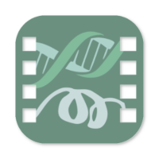

# Biomovies documentation

## Brief description

Documentation for **Biomovies**, the **cross-platform** 3D biological structure **video editor**. This cross-platform, open-source software allows the **creation** of **movies** starting from a 3D biological structure file such as a **PDB** or a **MMCIF** file. Additionally, the application **accepts trajectories** coupled with its corresponding topology. The accepted trajectory formats are **NETCDF**, **XTC** and **DCD**.

Thanks to its simplicity and the intuitive interface, users can build videos **easily and quickly**. The application allows the creation of **low resolution** and **HD** videos as well as **animated GIF** images.

The projects can be saved into **.biomovies** files for the sake of **sharing** or **editing** them later. Templates can be **exported** too, allowing to apply the same edition to different biological structures.

Visit the [**official website** <i class="fa-solid fa-up-right-from-square" style="font-size: 12px;"></i>](https://gbayarri.github.io/biomovies/) for watching demonstration **videos** and **tutorials**.

## Demo

Below there is a video generated with **Biomovies** software. More videos available in the [**website gallery** <i class="fa-solid fa-up-right-from-square" style="font-size: 12px;"></i>](https://gbayarri.github.io/biomovies/#gallery).

<iframe width="560" height="315" src="https://www.youtube.com/embed/-cEe-mtP2VU?si=7cT5b4eUvOxmbubg" title="YouTube video player" frameborder="0" allow="accelerometer; autoplay; clipboard-write; encrypted-media; gyroscope; picture-in-picture; web-share" allowfullscreen style="margin-bottom: 30px;"></iframe>

## Documentation & help

All the documentation is accessible through [**Read the Docs**](https://biomovies-documentation.readthedocs.io).

## Software / Hardware requirements

* **macOS:** Mac OSX 10.12+ supported, 16GB of RAM recommended
* **Linux:** Ubuntu 18.04 or greater, 16GB of RAM recommended
* **Windows:** Windows 10, 16GB of RAM recommended

## Installation

Please take a look at the [**installation section**](installation.html) in this same documentation.

## Features

Though we have put all our effort in making **Biomovies** a fully **cross-platform** software, there are a few **minor features** not available in some of the operating systems:

Feature | macOS |  Ubuntu | Windows

**Create projects** | ✅ | ✅ | ✅

**Run trajectories** | ✅ | ✅ | ✅

**Export templates** | ✅ | ✅ | ✅

**Create preview videos** | ✅ | ✅ | ✅

**Create HD videos** | ✅ | ✅ | ✅

**Create animated GIFs** | ✅ | ✅ | ✅

**Dock menu / JumpList** | ✅ | ❌ | ✅

**Open recent projects** | ✅ | ❌ | ❌

## Technology

This project has been built using [**Vue JS** <i class="fa-solid fa-up-right-from-square" style="font-size: 12px;"></i>](https://vuejs.org/) on top of [**Electron JS** <i class="fa-solid fa-up-right-from-square" style="font-size: 12px;"></i>](https://www.electronjs.org/), using the [**PrimeVue** <i class="fa-solid fa-up-right-from-square" style="font-size: 12px;"></i>](https://primevue.org/)  components library to enhance the user experience.

## Acknowledgements

This project has been developed on top of different JavaScript libraries:

* [**NGL viewer: web-based molecular graphics for large complexes** <i class="fa-solid fa-up-right-from-square" style="font-size: 12px;"></i>](http://dx.doi.org/10.1093/bioinformatics/bty419)
* [**NGL Viewer: a web application for molecular visualization** <i class="fa-solid fa-up-right-from-square" style="font-size: 12px;"></i>](http://dx.doi.org/10.1093/nar/gkv402)
* [**FFMPEG WASM** <i class="fa-solid fa-up-right-from-square" style="font-size: 12px;"></i>](https://ffmpegwasm.netlify.app/)
* [**Animation Timeline Control** <i class="fa-solid fa-up-right-from-square" style="font-size: 12px;"></i>](https://github.com/ievgennaida/animation-timeline-control)

## Copyright & licensing

This software has been developed by the [**MMB group** <i class="fa-solid fa-up-right-from-square" style="font-size: 12px;"></i>](https://mmb.irbbarcelona.org/) at the [**IRB Barcelona** <i class="fa-solid fa-up-right-from-square" style="font-size: 12px;"></i>](https://irbbarcelona.org/).

© 2023 **Institute for Research in Biomedicine**

Licensed under the **GPL-3.0 license**
